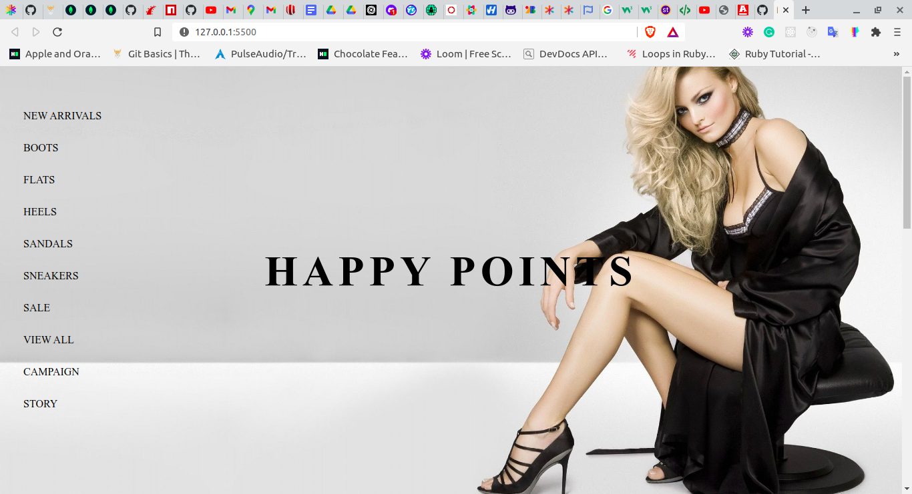

# Fashion88 Design

> This a Design from Hamsa.co

## Screenshot

## Built With

- JavaScript
- HTML5
- CSS

## Getting Started

To get a local copy up and running follow these simple example steps.

### Prerequisites

Text editor
Get a browser like chrome or firefox in their recent versions
Node.js
Node Package Manager

### Usage

- Clone this Repository using the command `git@github.com:keneogu/fashion88.git`
- Navigate to the directory `git checkout develop` in your code editor
- Run index.html on your browser of preference. Recommended: Chrome/Firefox
- If you wish to play around the codes, navigate to this Repository in the Text Editor

👤 **Kenechukwu Oguagbaka**

- GitHub: [@keneogu](https://github.com/keneogu)
- Twitter: [@keneogu](https://twitter.com/keneogu)
- LinkedIn: [@keneogu](https://www.linkedin.com/in/kene-ogu/)

## 🤝 Contributing

Contributions, issues and feature requests are welcome!

## Show your support

Give a ⭐️ if you like this project!

## Acknowledgments

Hamsa.co
Tùng Nguyễn Thanh

## 📝 License

Copyright 2021 Kene Ogu